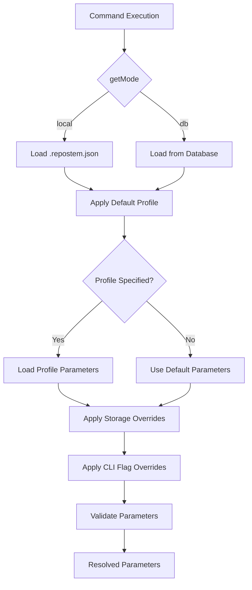

# RepoStem Architecture v3.1

## Vision

RepoStem models repositories as dependency graphs and computes structural risk metrics to help developers understand architectural fragility.

The long-term vision is to evolve RepoStem into an AI cognition layer for repositories — capable of reasoning about architecture, evolution, and structural health over time.

---

# v0.3.1 Scope

RepoStem now supports configurable parameters with two deployment modes and centralized threshold management. The mode system is designed to be extensible for future modes (e.g. server).

## New Capabilities
- Centralize all risk, drift, hotspot, and signal thresholds
- Support two deployment modes: `local` (stateless) and `db` (persistent)
- Explicit `mode` field in config — no more implicit inference from field presence
- Hierarchical parameter resolution with profiles and overrides
- Built-in parameter profiles for different analysis sensitivities
- CLI parameter management without manual JSON editing
- Zod-based parameter validation

## New Commands
- `repostem config` – View and manage parameters
- `repostem config --set` – Update specific parameters
- `repostem config --profile` – Switch parameter profiles
- `repostem config --save-profile` – Save custom profiles

---

# Deployment Modes

## Mode Classification

RepoStem supports two deployment modes today, with the system designed to accommodate additional modes in the future without breaking changes.

The active mode is stored explicitly as a `mode` field in `.repostem.json`. This replaces the previous approach of inferring mode from field presence, which was fragile and ambiguous.

---

### Mode: `local`

Stateless analysis with no persistence. All analysis runs in-memory; no snapshots are saved between runs.

- **Config source**: `.repostem.json` (ignore patterns, gitignore settings only)
- **Storage**: None — no database, no file beyond the config itself
- **repo_id**: Not generated — no identity needed without persistence
- **Use case**: Quick one-off analysis, CI runs that don't need history, exploring a new codebase
- **Network**: Fully offline

`.repostem.json` example:
```json
{
  "mode": "local",
  "respectGitignore": true,
  "ignore": ["dist", "node_modules"],
  "parameters": {
    "profile": "strict"
  }
}
```

---

### Mode: `db`

Persistent analysis backed by a local SQLite file or a remote PostgreSQL database. Snapshots are saved and commands like `drift`, `hotspot trends`, and `history` become available.

- **Config source**: `.repostem.json` for connection details; parameter overrides stored in database
- **Storage**: SQLite (local file) or PostgreSQL (remote)
- **repo_id**: Generated with `crypto.randomUUID()` on first `init`, stored in `.repostem.json`
- **Use case**: Individual developers tracking architectural health over time, team environments sharing a database
- **Network**: Offline for SQLite; requires connectivity for PostgreSQL

`.repostem.json` example:
```json
{
  "mode": "db",
  "storage_type": "sqlite",
  "storage_path": "./.repostem.db",
  "repo_id": "042cf799-f376-4117-9594-2b02fa9f04d2",
  "parameters": {
    "profile": "strict",
    "hotspots": {
      "threshold": 0.25
    }
  }
}
```

---

### Future Mode: `server` _(not yet implemented)_

In a future release, a `server` mode will allow RepoStem to delegate storage and identity management to a centralized RepoStem server (REST API). This supports GitHub App integration, Web UI, and multi-repo CI/CD workflows.

The mode system is designed so adding `server` requires only:
1. A new branch in `getMode()` / `initializeRepo()` / `collectConfig()`
2. A `ServerParameterStorage` implementation of the `ParameterStorage` interface
3. No changes to the engine core or existing mode logic

When implemented, the config will look like:
```json
{
  "mode": "server",
  "server_url": "https://repostem.example.com",
  "server_api_key": "...",
  "repo_id": "<assigned by server during init>"
}
```

---

## Mode Type Definition

```typescript
// All current and planned modes are enumerated here.
// Adding a new mode is additive — existing modes are unaffected.
export type RepoStemMode = 'local' | 'db' | 'server'; // 'server' reserved for future
```

## Config Schema

```typescript
export interface RepoStemConfig {
  // Explicit mode — required after init, no inference
  mode: RepoStemMode;

  // Shared options
  ignore?: string[];
  respectGitignore?: boolean;
  parameters?: ParameterConfig;

  // db mode only
  storage_type?: 'sqlite' | 'postgresql';
  storage_path?: string;
  repo_id?: string;

  // server mode only (reserved, not yet used)
  server_url?: string;
  server_api_key?: string;
}
```

## Mode Resolution

`getMode()` reads the explicit `mode` field. For backward compatibility with configs created before v0.3.1, it falls back to inference:

```typescript
export function getMode(repositoryRoot: string): RepoStemMode | null {
  const config = getConfig(repositoryRoot);

  if (config.mode) return config.mode;

  // Backward compatibility: infer from field presence
  if (config.server_url) return 'server';
  if (config.storage_type && config.storage_path) return 'db';

  return null; // not yet initialized
}
```

---

# `repostem init` Flow

The `init` command first asks which mode the user wants. Subsequent prompts depend on the selected mode.

```
repostem init
  └─ ? Select mode:
       ├─ local — stateless, no persistence
       │    → writes { mode: "local" } to .repostem.json
       │    → no repo_id generated, no DB setup
       │
       └─ db — persistent snapshots (SQLite or PostgreSQL)
            → ? storage type: sqlite / postgresql
            → ? path (SQLite) or connection string (PostgreSQL)
            → generates repo_id = crypto.randomUUID()
            → runs DB migrations
            → writes { mode: "db", storage_type, storage_path, repo_id }
```

## repo_id by Mode

| Mode | repo_id behavior |
|---|---|
| `local` | Not generated — no identity needed |
| `db` | `crypto.randomUUID()` on first init, stored in `.repostem.json` |
| `server` _(future)_ | Assigned by server during `POST /api/repos`, stored in `.repostem.json` |

---

# Parameter System Architecture

## Parameter Resolution Hierarchy

```
Engine Defaults → Profile → Storage → CLI Flags
```

1. **Engine Defaults**: Base parameter values (default profile)
2. **Profile**: Named parameter set (strict, permissive, etc.)
3. **Storage**: Mode-specific parameter overrides
4. **CLI Flags**: Command-line parameter overrides

## Parameter Schema

```typescript
interface ParameterConfig {
  profile?: string;
  risk?: {
    weights?: {
      centrality: number;        // 0.3
      coupling: number;          // 0.25
      circularDependency: number; // 0.25
      churn: number;             // 0.2
    };
    thresholds?: {
      low: number;               // 0.3
      medium: number;            // 0.6
    };
  };
  hotspots?: {
    threshold: number;           // 0.2
    limit: number;               // 5
    weights?: {
      risk: number;              // 0.5
      impact: number;            // 0.3
      churn: number;             // 0.15
      cycleBonus: number;        // 0.05
    };
  };
  drift?: {
    riskDelta: number;           // 0.05
    impactDeltaRatio: number;    // 0.01
    impactDeltaCount: number;    // 50
    hotspotThreshold: number;    // 0.2
  };
  complexity?: {
    weights?: {
      edgeDensity: number;       // 0.3
      cycleRatio: number;        // 0.4
      averageConnectivity: number; // 0.3
    };
  };
  signals?: {
    highChurn: number;           // 0.8
    highCentrality: number;      // 0.3
  };
}
```

## Built-in Profiles

### Default Profile
Current RepoStem behavior with balanced thresholds.

### Strict Profile
Lower thresholds for higher sensitivity:
- Risk thresholds: low=0.2, medium=0.5
- Hotspot threshold: 0.15
- Drift thresholds: riskDelta=0.03, impactDeltaRatio=0.005

### Permissive Profile
Higher thresholds for fewer flags:
- Risk thresholds: low=0.4, medium=0.7
- Hotspot threshold: 0.3
- Drift thresholds: riskDelta=0.1, impactDeltaRatio=0.02

### Churn-Focused Profile
Emphasizes churn in risk calculations:
- Risk weights: centrality=0.25, coupling=0.2, circularDependency=0.2, churn=0.35

### Structure-Focused Profile
Emphasizes structural metrics:
- Risk weights: centrality=0.4, coupling=0.35, circularDependency=0.15, churn=0.1

---

# Configuration Storage

## `local` Mode Storage

Parameters stored in `.repostem.json` only. No database involved.

```json
{
  "mode": "local",
  "parameters": {
    "profile": "strict",
    "hotspots": {
      "threshold": 0.25
    }
  }
}
```

## `db` Mode Storage

Connection details in `.repostem.json`; parameter overrides stored in database tables:

```sql
-- Parameter profiles (built-in and custom)
CREATE TABLE parameter_profile (
    id TEXT PRIMARY KEY,
    repo_id TEXT NOT NULL REFERENCES repo(id) ON DELETE CASCADE,
    name TEXT NOT NULL,
    parameters TEXT NOT NULL, -- JSON
    is_builtin BOOLEAN DEFAULT FALSE,
    created_at TIMESTAMP DEFAULT CURRENT_TIMESTAMP
);

-- Repository-specific parameter overrides
CREATE TABLE parameter_override (
    repo_id TEXT PRIMARY KEY REFERENCES repo(id) ON DELETE CASCADE,
    parameters TEXT NOT NULL, -- JSON overrides only
    updated_at TIMESTAMP DEFAULT CURRENT_TIMESTAMP
);
```

## Parameter Resolution Flow



---

# Repository ID Management

## Mode-Specific Behavior

### `local` Mode
- No `repo_id` — persistence is not used, so identity is not needed
- All analysis is ephemeral

### `db` Mode
- `repo_id` generated with `crypto.randomUUID()` on first `init`
- Stored in `.repostem.json`
- Serves as the primary key for all database operations
- Shared across team members connecting to the same database

## ServiceContext

```typescript
interface ServiceContext {
  repoPath: string;
  mode: RepoStemMode;
  config: RepoStemConfig;
  // Only populated for db mode:
  repo?: SnapshotRepository;
  adapter?: DatabaseAdapter;
  branch?: string;
}
```

---

# Parameter Validation

## Zod Schema Validation

All parameters validated using Zod schemas:

```typescript
import { z } from 'zod';

const RiskWeightsSchema = z.object({
  centrality: z.number().min(0).max(1),
  coupling: z.number().min(0).max(1),
  circularDependency: z.number().min(0).max(1),
  churn: z.number().min(0).max(1),
}).refine(
  (weights) => Math.abs(weights.centrality + weights.coupling +
                   weights.circularDependency + weights.churn - 1.0) < 0.001,
  { message: "Risk weights must sum to 1.0" }
);

const RiskThresholdsSchema = z.object({
  low: z.number().min(0).max(1),
  medium: z.number().min(0).max(1),
}).refine(
  (thresholds) => thresholds.low < thresholds.medium,
  { message: "Low threshold must be less than medium threshold" }
);

const ParameterConfigSchema = z.object({
  profile: z.enum(['default', 'strict', 'permissive', 'churn-focused', 'structure-focused']).optional(),
  risk: z.object({
    weights: RiskWeightsSchema.optional(),
    thresholds: RiskThresholdsSchema.optional(),
  }).optional(),
  hotspots: z.object({
    threshold: z.number().min(0).max(1),
    limit: z.number().positive().integer(),
    weights: z.object({
      risk: z.number().min(0).max(1),
      impact: z.number().min(0).max(1),
      churn: z.number().min(0).max(1),
      cycleBonus: z.number().min(0).max(1),
    }).optional(),
  }).optional(),
  // ... other parameter sections
});
```

## Validation Timing

### Load-Time Validation
- Validates configuration when loaded from storage
- Prevents invalid configurations from persisting
- Provides immediate feedback to users

### Execution-Time Validation
- Validates parameters before each analysis operation
- Ensures CLI overrides are valid
- Catches runtime parameter corruption

---

# CLI Integration

## Parameter Management Commands

```bash
# View current effective parameters
repostem config

# View with source tracing
repostem config --trace

# Set specific parameter
repostem config --set parameters.hotspots.threshold=0.25

# Switch profile
repostem config --set parameters.profile=strict

# Reset parameter to profile default
repostem config --reset parameters.hotspots.threshold

# Save current configuration as custom profile
repostem config --save-profile my-team

# List available profiles
repostem config --list-profiles

# Show profile details
repostem config --show-profile strict
```

## Command Parameter Overrides

All analysis commands support parameter overrides:

```bash
# Profile selection
repostem analyze --profile strict

# Direct parameter overrides
repostem hotspot --hotspot-threshold 0.3 --hotspot-limit 10

# Risk threshold overrides
repostem analyze --risk-thresholds "0.2,0.5"

# Drift parameter overrides
repostem drift --drift-risk-delta 0.1 --drift-impact-ratio 0.02
```

---

# Engine Integration

## Parameter Resolution Service

```typescript
class ParameterResolver {
  constructor(private storage: ParameterStorage) {}

  async resolve(
    repoPath: string,
    cliOverrides?: Partial<ParameterConfig>
  ): Promise<ResolvedParameters> {
    // 1. Determine deployment mode
    const mode = getMode(repoPath);

    // 2. Load storage-specific parameters
    const storageParams = await this.storage.loadParameters(repoPath);

    // 3. Apply profile inheritance
    const profileParams = await this.applyProfile(storageParams);

    // 4. Apply CLI overrides
    const finalParams = this.mergeParameters(profileParams, cliOverrides);

    // 5. Validate final parameters
    return this.validateParameters(finalParams);
  }
}
```

## Storage Abstraction

The `ParameterStorage` interface is the extension point for new modes. Adding `server` mode requires only a new implementation — no changes to the resolver or engine.

```typescript
interface ParameterStorage {
  loadParameters(repoPath: string): Promise<ParameterConfig>;
  saveParameters(repoPath: string, parameters: ParameterConfig): Promise<void>;
  loadProfile(name: string): Promise<ParameterProfile>;
}

// local mode: reads/writes .repostem.json
class FileParameterStorage implements ParameterStorage { ... }

// db mode: reads/writes database tables
class DatabaseParameterStorage implements ParameterStorage { ... }

// server mode (future): reads/writes via REST API
// class ServerParameterStorage implements ParameterStorage { ... }
```

---

# Migration Strategy

## Auto-Migration Process

1. **Detection**: Identify existing configs without an explicit `mode` field
2. **Inference**: Apply backward-compat logic — if `storage_type` + `storage_path` present, treat as `db`; otherwise treat as `local`
3. **Write**: Persist the inferred `mode` to `.repostem.json` silently
4. **Validation**: Run Zod validation to ensure integrity
5. **Notification**: Silent migration unless errors occur

## Backward Compatibility

- Existing configs without `mode` are auto-migrated on first use
- Existing function signatures maintained during transition
- Hardcoded thresholds serve as fallbacks during migration
- All current CLI commands continue working without changes
- Gradual migration of engine functions to parameter system

---

# Architectural Principles

- **Mode-agnostic core**: Engine logic independent of deployment mode
- **Explicit over implicit**: `mode` field is always written; inference is only a backward-compat fallback
- **Extensible by addition**: New modes (e.g. `server`) require only new implementations of existing interfaces — no changes to existing mode logic
- **Hierarchical configuration**: Clear precedence from defaults to overrides
- **Type-safe parameters**: Zod validation ensures runtime safety
- **Progressive migration**: Existing functionality preserved during transition
- **Profile-based customization**: Easy switching between analysis sensitivities
- **CLI-first configuration**: No manual JSON editing required

---

# Implementation Phases

## Phase 1: Core Infrastructure
- Define `RepoStemMode` type and add `mode` field to `RepoStemConfig`
- Implement `getMode()` with backward-compat inference
- Update `initializeRepo()` to branch by mode
- Define parameter types and Zod schemas
- Implement `ParameterStorage` abstraction with `FileParameterStorage` and `DatabaseParameterStorage`
- Create built-in profiles
- Add parameter resolver service

## Phase 2: CLI Integration
- Update `repostem init` to prompt for mode first, then mode-specific options
- Implement `repostem config` command
- Add parameter flags to existing commands
- Update command handlers to use resolver
- Add auto-migration logic for existing configs

## Phase 3: Engine Migration
- Update engine functions to accept parameters
- Implement backward compatibility layer
- Update all existing tests

## Phase 4: Advanced Features
- Custom profile management
- Advanced validation and error handling
- Performance optimization


